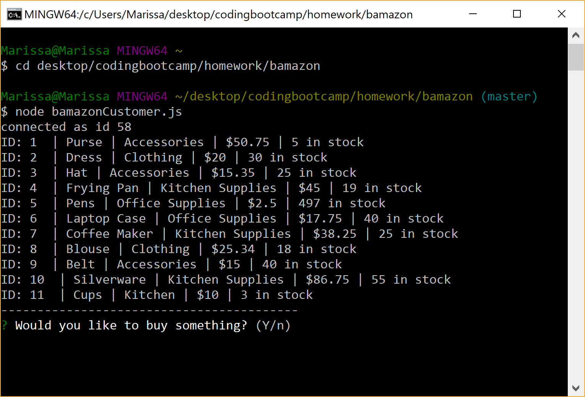
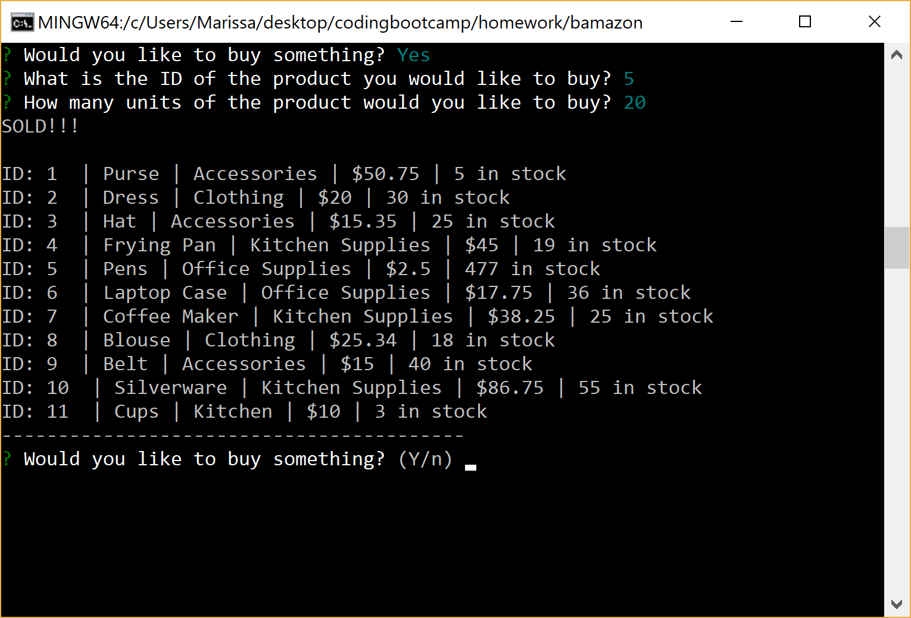

# bamazon

The Bamazon application is a storefront that uses MySQL to manage the inventory. There are three different node JS files that can be run in the terminal depending on if the user of the application is a customer, manager, or supervisor.

## bamazonCustomer.js

When bamazonCustomer.js is ran in the terminal, all of the products in the inventory will be displayed. This information will include the product name, the product department, the price, and the quantity in stock. The user will also be prompted, "Would you like to buy something?"

If the user selects yes, the user will then be asked for the ID of the product that they would like to buy and the quantity. When the order has been gone through, the user will see the text, "SOLD!!!" across the screen, and all of the products will be displayed again.

## bamazonManager.js