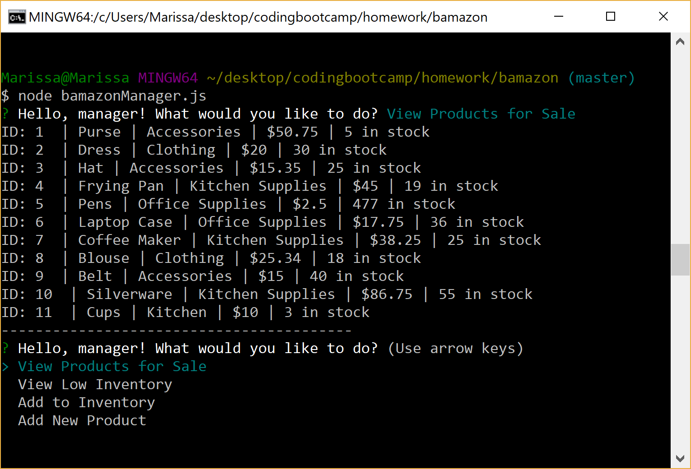

# Bamazon

The Bamazon application is a storefront that uses MySQL to manage the inventory. There are three different node JS files that can be run in the terminal depending on if the user of the application is a customer, manager, or supervisor.

## bamazonCustomer.js

When bamazonCustomer.js is ran in the terminal, all of the products in the inventory will be displayed. This information will include the product name, the product department, the price, and the quantity in stock. The user will also be prompted, "Would you like to buy something?"

If the user selects yes, the user will then be asked for the ID of the product that they would like to buy and the quantity. When the order has been gone through, the user will see the text, "SOLD!!!" across the screen, and all of the products will be displayed again.

## bamazonManager.js

When the bamazonManager.js is ran in the terminal, the user will be asked whether they would like to:
* View Products for Sale
* View Low Inventory
* Add to Inventory
* Add New Product 

If View Products for Sale is selected, all of the products in the inventory will be displayed. This information will include the product name, the product department, the price, and the quantity in stock.

If View Low Inventory is selected, all of the products with less than 5 items in stock will be displayed.

If Add to Inventory is selected, the user will be asked for the product and quantity that they would like to update.

If Add a New Product is selected, the user will be asked for the product name, the product department, the price, and the quantity in stock. The user can confirm that the product has been added by then choosing View Products for Sale.

## bamazonSupervisor.js

When the bamazonSupervisor.js is ran in the terminal, the user will be asked whether they would like to:
* View Product Sales by Department
* Create New Department

If View Product Sales by Department is selected, the table will be displayed showing the department ID, the department name, overhead costs, product sales, and total profit.

If Create New Department is selected, the user will be asked for the new department name and the overhead costs for that department. When the department was successfull created, the message "Department Added!" will be displayed. 

The user can also confirm that the department was created by choosing the View Product Sales by Department option again.

